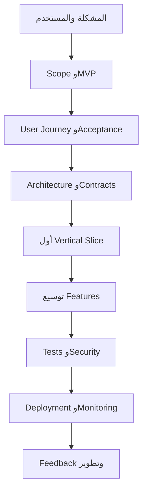
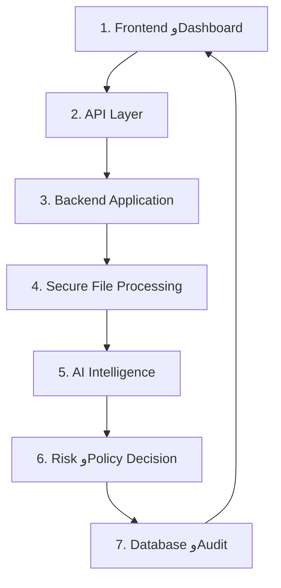
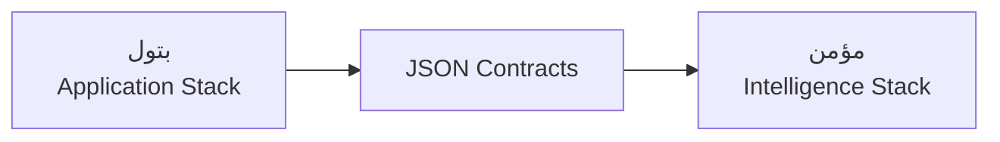

# AmanGrid - Master Project Context, Team Workflow & Session Bootstrap

> **الغرض من الملف:** نقل سياق مشروع AmanGrid إلى جلسة AI جديدة داخل بيئة VS Code المطوّرة، ومنع إعادة اكتشاف القرارات أو خلط ما هو معتمد بما هو مقترح.
>
> **حالة الوثيقة:** Context Handoff + Planning Baseline
>
> **التاريخ:** 2026-08-28
>
> **الوضع المطلوب عند فتح جلسة جديدة:** `PLAN / READ ONLY` أولًا. لا تعديل قبل فحص المستودع وعرض Project Intake Report.

---

## 0. تعليمات إلزامية للجلسة الجديدة - اقرأ قبل أي عمل

### MANDATORY SESSION BOOTSTRAP

هذا الملف هو مرجع التخطيط الكامل، وليس ملفًا يجب إعادة تحميله في كل Task. عند فتح جلسة جديدة، يجب اتباع Bootstrap متدرج يحافظ على السياق:

#### المستوى الأول - إلزامي في كل جلسة

1. اقرأ `AGENTS.md` كاملًا.
2. اقرأ `README.md` و`docs/CURRENT_HANDOFF.md` كاملين.
3. افحص حالة Git دون تعديل:
   - المستودع والمسار الحاليان.
   - الفرع وHEAD.
   - `git status`.
   - آخر commits ذات الصلة.
   - التغييرات الموجودة مسبقًا.
4. حدد Task ID وMode الحاليين، واقرأ فقط الكود والوثائق اللازمة للمهمة.

#### المستوى الثاني - عند الحاجة فقط

اقرأ هذا الملف كاملًا عندما:

- تبدأ Milestone جديدة؛
- يتغير Scope أو Architecture أو تقسيم الملكية؛
- تُنشأ أو تتغير JSON Contracts أو سياسة التصنيف/الخطر؛
- يكون `docs/CURRENT_HANDOFF.md` مفقودًا أو قديمًا أو غير كافٍ؛
- يظهر تعارض يحتاج الرجوع إلى قرارات التخطيط المعتمدة.

اقرأ وثيقتي المنتج والتصميم تحت `docs/references/` فقط عندما تحتاج المهمة متطلبات المنتج، سياسة التصنيف والخطر، الرسم المعماري، أو تفاصيل الواجهة والتصميم. لا تعِد قراءتهما كاملتين في مهام Git أو الاختبارات أو التنفيذ الروتيني غير المرتبط بهما.

#### قواعد الفحص والعمل

5. افحص الـstack الفعلي من الملفات، وليس من التوقعات: Backend، Frontend، Database/Migrations، AI/ML، Tests، Infrastructure وCI.
6. استخدم فقط الـAgents والـSkills والأدوات المرتبطة بالمهمة الحالية. لا تحمّل Catalog كاملًا دون حاجة.
7. قارن الواقع الحالي مع `docs/CURRENT_HANDOFF.md`، ثم مع هذا الملف عند الحاجة. لا تعتبر أي عنصر منفذًا لمجرد ذكره في وثيقة.
8. إذا وجدت تعارضًا، اعرض المصدرين والأثر والتوصية بدل حسمه بصمت.
9. لا تعدّل ملفًا ولا تنشئ branch أو commit أو push ولا تشغّل أمرًا مدمرًا قبل فهم المهمة وMode الحالي.
10. بعد الفحص الأولي، أعط المستخدم التقرير التالي:

```text
PROJECT:
PATH:
CURRENT BRANCH:
HEAD:
WORKING TREE:
STACK DETECTED:
BACKEND:
FRONTEND:
DATABASE:
AI/ML:
TESTS AND LAST KNOWN RESULTS:
IMPORTANT INSTRUCTIONS READ:
IMPORTANT PROJECT DOCS READ:
IMPLEMENTED NOW:
PLANNED BUT NOT IMPLEMENTED:
DIFFERENCES FROM THIS HANDOFF:
RELEVANT AGENTS:
RELEVANT SKILLS:
RISKS / BLOCKERS:
RECOMMENDED FIRST TASK:
FILES EXPECTED TO CHANGE:
VALIDATION PLAN:
```

### STOP GATE

بعد Project Intake Report، توقّف في وضع `PLAN / READ ONLY` واعرض خطة العمل المقترحة. لا تبدأ التنفيذ إلا إذا طلب مؤمن ذلك بوضوح.

---

## 1. ترتيب مصادر الحقيقة

عند قراءة المشروع، استخدم ترتيب الأولوية التالي:

1. **حالة Git والكود والاختبارات الحالية:** الحقيقة التقنية لما هو موجود ومنفذ الآن.
2. **تعليمات المستودع:** القواعد الإلزامية لطريقة العمل والأمان.
3. **هذا الملف:** قرارات المشروع وتقسيم الفريق وطريقة التعاون المعتمدة في المحادثة.
4. **`AmanGrid_Application_0.1_AR.pdf`:** تعريف المنتج، المشكلة، المستخدم، نطاق MVP والحدود.
5. **`AmanGrid_Application_Design_0.2_AR.pdf`:** المعمارية، رحلة الملف، التصنيف، الخطر، DLP، الشاشات وترتيب التنفيذ.

إذا ظهر تعارض، لا تُلغِ مصدرًا بصمت. الكود يحدد الواقع الحالي، لكن وثائق المنتج تحدد الهدف والنطاق. اطلب قرارًا عندما يغيّر التعارض معنى المنتج أو حدود MVP.

---

## 2. الملخص التنفيذي للمشروع

### الاسم الرسمي

**AmanGrid - تطبيق ذكي لحماية البيانات وإدارة مخاطرها في قطاع الطاقة**

**English:** AmanGrid - AI-Powered Data Security Application for the Energy Sector

### الشعار

> نفهم البيانات، نقيّم مخاطرها، ثم نحميها.

> Understand Data. Assess Risk. Recommend Protection.

### تعريف المنتج

AmanGrid في نسخته الأولى هو تطبيق ويب يسمح لمحلل الأمن السيبراني برفع ملف PDF أو Word، أو إدخال نص، ثم:

1. يتحقق من الملف ويقرأ الـMetadata.
2. يستخرج النص بصورة آمنة.
3. يكتشف البيانات الحساسة والأنماط الأمنية.
4. يفهم سياق الطاقة وSCADA/OT.
5. يصنّف المحتوى إلى أحد أربعة مستويات.
6. يحسب Confidence وRisk Score.
7. يطبق Policy مبسطة.
8. يقترح إجراء حماية مفسرًا.
9. يحوّل الحالات المناسبة إلى Human Review.
10. يحفظ النتيجة والقرارات في History وAudit Log.

### المشكلة

تحتوي مؤسسات الطاقة على ملفات تشغيلية وشخصية وسرية موزعة بين أجهزة وخوادم ومواقع تخزين مختلفة. قد يصعب على فريق الأمن معرفة:

- أي الملفات حساسة؟
- ما مستوى حساسيتها؟
- هل تتضمن معلومات SCADA/OT أو Credentials أو بيانات عملاء؟
- هل موقع التخزين أو نطاق المشاركة آمن؟
- ما الخطر الحالي؟
- ما الإجراء الأمني المناسب ولماذا؟

### المستخدم الأساسي

**Cybersecurity Analyst داخل شركة طاقة.**

المستخدمون الثانويون المحتملون:

- مسؤول الأمن السيبراني.
- Data Owner.
- Data Steward.
- مسؤولو IT وOT.

### المبدأ الحاكم

> الذكاء الاصطناعي يحلل ويقترح ويفسر، لكن سياسة المؤسسة والمراجعة البشرية تبقيان المرجع النهائي للقرارات الحساسة.

---

## 3. ما هو AmanGrid وما ليس هو

### AmanGrid MVP هو

- تطبيق ويب قابل للعرض والتجربة.
- تحليل Metadata ومحتوى ملف أو نص يرفعه المستخدم.
- Hybrid Analysis يجمع Rules + Metadata + AI Context + Policy.
- قرار مفسر يتضمن Classification وConfidence وRisk وEvidence وRecommendation.
- Human-in-the-Loop للحالات الحساسة أو غير المؤكدة.
- إجراءات DLP على شكل **Recommendation أو Simulation فقط**.

### AmanGrid MVP ليس

- منصة مؤسسية كاملة.
- DLP تجاريًا جاهزًا.
- أداة تحكم مباشر بأنظمة SCADA أو OT.
- نظام Multi-Agent كامل.
- نظامًا يفحص المؤسسة تلقائيًا أو باستمرار.
- نظامًا يستخدم بيانات حقيقية حساسة تخص شركة الكهرباء أو العملاء.

### قاعدة منع توسع النطاق

لا تضف وظيفة إلى MVP إلا إذا كانت ضرورية لسيناريو العرض الرئيسي. أي فكرة جديدة توضع في `Future Development`. وإذا كان لا بد من إضافة وظيفة بعد تثبيت النطاق، يجب حذف أو تأجيل وظيفة أخرى بقيمة زمنية مماثلة.

---

## 4. سيناريو العرض الرئيسي

السيناريو الذي يجب أن يعمل End-to-End:

> يرفع محلل الأمن السيبراني ملفًا تجريبيًا اسمه `SCADA_Network_Maintenance_Report.pdf` عُثر عليه في موقع تخزين غير معتمد. يحتوي الملف على بيانات SCADA/OT افتراضية، عناوين IP داخلية، معلومات PLC، معرفات معدات، تعليمات صيانة، بيانات موظفين تجريبية ومفتاح وصول تجريبي. يحلله AmanGrid، يصنفه Restricted، يفسر الأدلة، يقيّم الخطر Critical، يقترح Quarantine/Encrypt/Restrict Access/Alert، ثم يرسله إلى Human Review.

ملاحظتان مهمتان:

- أرقام مثل `96% Confidence` و`89` أو `91 Risk Score` في وثائق التصميم أمثلة توضيحية وليست قيمًا يجب hard-code لها.
- جميع البيانات المستخدمة في العرض Synthetic أو Fictional، وليست بيانات شركة حقيقية.

---

## 5. الخريطة الذهنية لأي مشروع وعلاقتها بـAmanGrid

الـFrontend والـBackend والـDatabase ليست مراحل متتابعة يجب إنهاء كل واحدة منها كاملة قبل الأخرى؛ هي **طبقات تتعاون**. ترتيب بناء المشروع هو ترتيب القرارات ورحلة المستخدم:



### توضيح المصطلحات

| المصطلح | المعنى |
|---|---|
| Frontend | كل ما يراه المستخدم ويتفاعل معه. |
| Dashboard | شاشة أو مجموعة شاشات داخل الـFrontend، وليست طبقة منفصلة. |
| API | العقد والباب الذي تتواصل عبره الواجهة أو الخدمات مع الـBackend. |
| Backend | ينظم رحلة العمل، يتحقق من الطلبات ويطبق منطق النظام. |
| Database | تحفظ البيانات والنتائج بصورة دائمة. |
| SQL | لغة للاستعلام والتعامل مع قواعد البيانات العلائقية. |
| PostgreSQL | محرك قاعدة بيانات علائقية يفهم SQL؛ لا يُفترض استخدامه إلا بعد تأكيد الـstack من المستودع. |
| Architecture | تصميم حدود المكونات ومسؤولياتها وتدفق البيانات بينها. |
| Contract | شكل البيانات المتفق عليه بين مكوّنين. |
| Vertical Slice | وظيفة صغيرة تعمل عبر جميع الطبقات من الواجهة إلى النتيجة بدل بناء طبقة كاملة منعزلة. |

### النهج المعماري المقترح لفريق صغير

**Modular Monolith + Contract-First + Vertical Slice**

- تطبيق Backend واحد في البداية، داخله Modules واضحة.
- قاعدة بيانات واحدة في البداية إذا كان ذلك متوافقًا مع الـstack الفعلي.
- Single Hybrid AI Agent/Engine بوحدات داخلية واضحة، وليس Multi-Agent كاملًا.
- تثبيت العقود قبل الربط.
- بناء أول رحلة كاملة صغيرة ثم توسيع الوظائف.
- تجنب Microservices والتكاملات المؤسسية المعقدة في MVP.

هذا نهج معماري مقترح ومعتمد في التخطيط، لكنه لا يعني أن المستودع طُبّق بهذه الصورة؛ يجب فحصه أولًا.

---

## 6. طبقات AmanGrid



هناك ثلاث مسؤوليات تعبر جميع الطبقات:

- Security.
- Testing & Quality.
- Infrastructure & Deployment.

### مسؤولية كل طبقة

| الطبقة | مسؤوليتها في AmanGrid |
|---|---|
| Frontend | Login، Analyze File، Progress، Result، Review، History، Dashboard، Policy UI. |
| API | استقبال الطلبات، validation، responses/errors، status، التكامل بين التطبيق ومحرك التحليل. |
| Backend Application | orchestration لرحلة التحليل، auth/session حسب MVP، error handling، lifecycle. |
| Secure File Processing | فحص النوع والحجم والسلامة، تخزين مؤقت، Metadata، استخراج النص، sanitization، حذف المؤقت. |
| AI Intelligence | Sensitive Detection، Energy/SCADA Context، Classification، Confidence، Evidence، Explanation. |
| Risk & Policy | Risk Score، Overrides، Policy Decision، DLP Recommendation، Human Review rules. |
| Database & Audit | النتائج، السياسات وإصداراتها، المراجعات، Feedback، الأحداث الأمنية وAudit trail. |

---

## 7. رحلة الملف داخل النظام

```text
Upload
  -> Validate
  -> Read Metadata
  -> Extract
  -> Detect
  -> Understand
  -> Classify
  -> Assess Risk
  -> Apply Policy
  -> Recommend Action
  -> Human Review عند الحاجة
  -> Audit / Persist / Delete Temporary File
```

### المراحل الثلاث

1. **الإدخال والحماية:** إنشاء File/Analysis ID، التحقق، التخزين المؤقت المحدود، رفض الملفات الخطرة.
2. **التحليل الذكي:** Metadata-first، Rules، Sensitive Detection، فهم سياق الطاقة، التصنيف والثقة.
3. **القرار والتعلم:** Risk، Policy، Recommendation، Review، Feedback، Audit وحذف الملف المؤقت.

### حالات استثنائية يجب التخطيط لها

- نوع أو حجم ملف غير مدعوم.
- فشل استخراج النص أو جزء مهم منه.
- ملف فارغ أو نص غير قابل للقراءة.
- تعارض AI مع Rule أمنية.
- Confidence منخفضة.
- تصنيف Critical أو قرار Block/Quarantine.
- قيمة Metadata غير معروفة.
- محاولة Prompt Injection داخل الملف.

---

## 8. التقسيم النهائي بين مؤمن وبتول

التقسيم المعتمد ليس "مؤمن Backend وبتول Frontend". التقسيم الأقوى هو:

> **بتول تملك جسم التطبيق، ومؤمن يملك عقل القرار الأمني.**



### ملكية الطبقات

| المجال | المالك الأساسي | المسؤوليات |
|---|---|---|
| Frontend + Dashboard | بتول | الشاشات، navigation، upload UI، states، results، review، history، dashboard، policy UI. |
| API + Backend orchestration | بتول | endpoints، lifecycle، validation، errors، استدعاء محرك مؤمن. |
| Secure File Processing | بتول | PDF/Word validation، extraction، temporary storage، cleanup. |
| Database + Audit | بتول | schema/migrations، persistence، history، review، feedback، audit. |
| Infrastructure | بتول | skeleton، local run، Docker/environment/deployment ضمن ما يثبته المستودع. |
| AI Intelligence | مؤمن | detection، SCADA/OT context، classification، confidence، evidence، explanation. |
| Risk & Policy | مؤمن | factors، weights، overrides، policy mapping، DLP recommendation، human-review triggers. |
| AI Evaluation | مؤمن | synthetic corpus، metrics، false negatives، edge cases، prompt injection، structured output. |
| Security | مقسمة | بتول: app/file/API/data security. مؤمن: prompt/AI/output safety. |
| Testing | مقسمة | كل شخص يختبر وحداته؛ integration وE2E مشتركان. |

### ما لا يُفصل بالكامل

ثلاث نقاط فقط تحتاج عملًا مشتركًا مباشرًا:

1. مراجعة وتجميد JSON Contracts.
2. Integration Test بين Application Stack وIntelligence Stack.
3. End-to-End Demo النهائي.

---

## 9. ما هو JSON Contract ولماذا يمنع انتظار أحدكما للآخر؟

الـJSON Contract يشبه مواصفات فيشة ومقبس:

- بتول لا تحتاج معرفة كيف بُنيت خوارزمية التصنيف.
- مؤمن لا يحتاج معرفة كيف بُني استخراج PDF/Word.
- المهم أن ترسل بتول بيانات بنفس الأسماء والأنواع المتفق عليها.
- وأن يعيد مؤمن نتيجة بالشكل الذي ينتظره تطبيق بتول.

العقد يحدد:

- أسماء الحقول وأنواعها.
- المطلوب والاختياري.
- القيم المسموحة.
- units/ranges مثل 0-100.
- شكل الحالات غير المعروفة والأخطاء.
- version.
- أمثلة وvalidation tests.

العقد لا يحدد طريقة تنفيذ كل Module داخليًا.

### العقد الأول - `ExtractedDocument`

Draft ناقشناه، ويجب تحويله في أول Task إلى JSON Schema فعلي ومراجعته مع بتول:

```json
{
  "contract_version": "1.0",
  "document_id": "doc-001",
  "file_name": "scada-report.pdf",
  "mime_type": "application/pdf",
  "text": "Extracted and sanitized document text...",
  "metadata": {
    "file_size_bytes": 245000,
    "page_count": 12,
    "owner": "Operations Department"
  },
  "security_context": {
    "storage_location": "personal_cloud",
    "encryption_status": "not_encrypted",
    "sharing_scope": "department_wide",
    "users_with_access": 46,
    "access_scope_known": true
  }
}
```

ملاحظة: إذا كانت طبقة بتول لا تستطيع معرفة owner أو storage/encryption/access scope في MVP، فلا تُختلق القيم. يجب أن يجعل العقد الحقل optional أو يسمح بقيمة `unknown` وفق قرار واضح.

### العقد الثاني - `AnalysisDecision`

```json
{
  "contract_version": "1.0",
  "analysis_id": "analysis-001",
  "document_id": "doc-001",
  "classification": {
    "level": "Restricted",
    "confidence": 96,
    "explanation": "The document contains operational OT information and access data."
  },
  "sensitive_findings": [
    {
      "type": "INTERNAL_IP",
      "count": 12
    },
    {
      "type": "CREDENTIAL",
      "count": 1
    }
  ],
  "energy_context": {
    "scada_ot_relevant": true,
    "evidence": [
      "SCADA topology",
      "OT configuration information"
    ]
  },
  "risk": {
    "base_score": 89,
    "final_score": 89,
    "level": "Critical",
    "triggered_overrides": [
      "OR-01",
      "OR-02",
      "OR-04"
    ]
  },
  "policy": {
    "recommendations": [
      "QUARANTINE",
      "ENCRYPT",
      "RESTRICT_ACCESS",
      "ALERT"
    ],
    "human_review_required": true,
    "execution_mode": "SIMULATED"
  }
}
```

هذه أمثلة تخطيط وليست دليلًا أن schemas موجودة في المستودع. يجب على الجلسة الجديدة التحقق.

### القيم الأساسية المتفق عليها

Classification:

- `Public`
- `Internal`
- `Confidential`
- `Restricted`

Risk level:

- `Low`
- `Medium`
- `High`
- `Critical`

Execution mode في MVP:

- `RECOMMENDED`
- `SIMULATED`

لا يجوز أن توحي النتيجة بأن إجراء DLP نُفذ فعليًا.

### Mock Fixtures المطلوبة

مؤمن يستطيع العمل على Mock Input قبل انتهاء استخراج بتول، وبتول تستطيع بناء الواجهة على Mock Output قبل انتهاء محرك مؤمن.

المطلوب على الأقل ثلاث حالات:

1. Public + Low.
2. Confidential + High.
3. Restricted + Critical.

ويُفضّل أن تكون لكل حالة ملفات Input وExpected Output منفصلة ومثبتة بالاختبارات.

---

## 10. سياسة التصنيف المعتمدة

| المستوى | المعنى | أمثلة |
|---|---|---|
| Public | محتوى معتمد للنشر العام دون ضرر جوهري. | تقارير منشورة، أخبار، مواد توعوية. |
| Internal | محتوى تشغيلي أو إداري للموظفين. | إجراءات داخلية، تعليمات عمل عامة، جداول اجتماعات. |
| Confidential | تسريبه قد يسبب ضررًا خصوصيًا أو ماليًا أو قانونيًا. | بيانات عملاء وفواتير، HR، عقود، بيانات عدادات مرتبطة بهوية. |
| Restricted | شديد الحساسية وقد يؤثر في العمليات الحرجة أو البنية التحتية. | SCADA/OT، Credentials/Keys، PLC configs، تفاصيل شبكات حرجة. |

### قاعدة الأولوية

إذا احتوى الملف على أكثر من نوع، يعتمد المستوى الأعلى:

```text
Restricted > Confidential > Internal > Public
```

مثال: ملف إداري Internal يحتوي API Key أو كلمة مرور يصبح Restricted حتى لو كان معظم محتواه غير حساس.

### حالات Human Review الأولية

- Confidence أقل من 70%.
- تعارض AI مع قاعدة أمنية.
- فشل استخراج جزء مهم.
- قرار Block أو Quarantine غير واضح.
- اكتشاف SCADA دون سياق كافٍ.
- حالة Critical أو Override يتطلب مراجعة.

هذه الحالات يجب تحويلها في Task العقود/السياسة إلى قواعد قابلة للاختبار، لا أن تبقى نصًا فقط.

---

## 11. نموذج Risk Scoring المرجعي

الأوزان المقترحة في وثيقة التصميم:

| العامل | الوزن |
|---|---:|
| Data Sensitivity | 30% |
| Operational Impact | 20% |
| Exposure Level | 20% |
| Access Scope | 15% |
| Storage Compliance | 10% |
| Protection Gap | 5% |

```text
Risk Score = Sensitivity
           + Operational Impact
           + Exposure
           + Access Scope
           + Storage Compliance
           + Protection Gap
```

يجب أن يحدد التنفيذ كيف تتحول قيمة كل عامل إلى نقاط ضمن وزنه؛ لا يكفي جمع نسب دون scale واضح.

### مستويات الخطر

| Score | Level | الاستجابة الافتراضية المقترحة |
|---:|---|---|
| 0-24 | Low | Allow / Log |
| 25-49 | Medium | Warn / Review |
| 50-74 | High | Restrict / Encrypt / Alert |
| 75-100 | Critical | Block / Quarantine / Human Review |

### Override Rules المقترحة

- Credentials + Unencrypted => الحد الأدنى High.
- Restricted + External Sharing => Risk Score لا يقل عن 85.
- SCADA + Credentials => Critical مع Human Review إلزامية.

هذه القواعد مرجعية من التصميم. يجب في Task Risk Model تثبيت:

- IDs ثابتة للقواعد.
- ترتيب تطبيقها.
- هل تعدل Base Score أم Final Score فقط؟
- طريقة التعامل مع عدة Overrides.
- تفسير كل Override في النتيجة.
- حدود القيم غير المعروفة.

---

## 12. Policy وDLP Recommendation

Classification يحدد ماهية البيانات، وRisk يحدد خطورة وضعها الحالي، وPolicy يحدد التوصية.

| Classification | Low | Medium | High | Critical |
|---|---|---|---|---|
| Public | Allow + Log | Warn | Review Integrity | Block until reviewed |
| Internal | Allow internally | Warn external sharing | Require justification | Block external sharing + Alert |
| Confidential | Authorized users only | Encrypt + Log | Restrict access + Alert | Block or Quarantine + Review |
| Restricted | Restrict + Encrypt | Monitor + Review | Block external transfer | Quarantine + Immediate Alert |

الإجراءات الممكنة في MVP:

- Allow.
- Log.
- Warn.
- Require Justification.
- Restrict Access.
- Block.
- Encrypt.
- Quarantine.
- Alert.
- Human Review.

كلها Recommended أو Simulated في MVP، ولا تنفذ فعليًا على أنظمة المؤسسة.

---

## 13. خريطة المهام النهائية

> **مهم:** ظهر في نقاش مبكر ترقيم أولي يضع Risk Model قبل Contracts. تم استبداله في آخر قرار عملي بالخريطة أدناه. هذه الخريطة هي المرجع الحالي، ويعاد تأكيدها بعد فحص المستودع.

### مسار مؤمن - Intelligence Stack

#### `AG-M-001 - Analysis Contracts and Test Fixtures`

- تحويل `ExtractedDocument` و`AnalysisDecision` إلى Schemas فعلية.
- تحديد required/optional/enums/ranges/null/unknown/error behavior.
- إضافة ثلاث حالات Mock أساسية.
- إضافة validation tests.
- Reviewer: بتول.
- هذا هو **أول Task لمؤمن**.

#### `AG-M-002 - Sensitive Data Detection`

- PII وemails وIDs.
- IP addresses.
- Credentials/API keys/password-like patterns.
- Meter/customer/equipment identifiers.
- SCADA/OT/PLC/energy infrastructure indicators.
- Evidence قابل للتفسير، مع تجنب تسريب secret كاملًا في output/logs.

#### `AG-M-003 - Classification Engine`

- تطبيق المستويات الأربعة وقاعدة الأولوية.
- Confidence.
- Explanation/Evidence.
- التعارض وعدم اليقين.
- Structured output مطابق للعقد.

#### `AG-M-004 - Risk Scoring Engine`

- تثبيت العوامل الستة والأوزان وطريقة التطبيع.
- Base Score وFinal Score.
- Override Rules وترتيبها.
- تفسير العوامل والقواعد المحفزة.
- Human Review triggers.

#### `AG-M-005 - Policy Engine`

- Classification/Risk matrix.
- DLP Recommendations.
- Recommended/Simulated execution mode.
- Rule versioning.
- Explainable policy result.

#### `AG-M-006 - AI Evaluation`

- Synthetic test corpus.
- Accuracy/Precision/Recall.
- False Negative Rate كأولوية أمنية.
- Explainability وPolicy Compliance وLatency.
- Unknown/ambiguous cases.
- Prompt Injection tests.
- Structured output stability.

### مسار بتول - Application Stack

#### `AG-B-001 - Application Skeleton`

- اكتشاف واعتماد الـstack الفعلي.
- هيكل Frontend/Backend/Database.
- local run.
- environment/config.
- health path أو smoke test.
- هذا هو **أول Task لبتول**.

#### `AG-B-002 - Upload and Secure Extraction`

- PDF/Word/manual text.
- type/size/safety validation.
- temporary storage.
- text وMetadata extraction.
- sanitization.
- cleanup/delete lifecycle.

#### `AG-B-003 - Analysis API and Lifecycle`

- Create analysis.
- status/progress/errors.
- استدعاء Intelligence Engine لاحقًا.
- Mock result في البداية مطابق للعقد.
- auth/authorization بالحد المناسب للـMVP.

#### `AG-B-004 - Results Experience`

- Loading/Error/Success.
- Classification وConfidence.
- Findings/Evidence/Explanation.
- Risk وfactors/overrides.
- Recommendations وHuman Review status.

#### `AG-B-005 - Database, History and Audit`

- schema/migrations.
- analyses/results.
- policy versions.
- reviews/feedback.
- history.
- audit events دون تخزين secrets أو محتوى زائد.

### Backlog لاحق لبتول - يعاد ترقيمه في جلسة التخطيط

- Human Review workflow.
- Analysis History screen.
- Dashboard.
- Policy Configuration UI.
- Export Summary.
- Responsive/accessibility/loading polish.

### مهام التكامل المشتركة - Owner واحد لكل Task

- Contract review/freeze.
- First real extracted document -> intelligence engine.
- First real decision -> API/database/frontend.
- End-to-End SCADA demo.
- Security review.
- Final quality gate and handoff.

لا تنشئ Task مشتركة بلا Owner. حتى Tasks التكامل يجب أن يكون لها منفذ أساسي ومراجع.

---

## 14. كيف يبدأ العمل دون انتظار؟

### البداية المتوازية

- **مؤمن يبدأ:** `AG-M-001` على Mock documents.
- **بتول تبدأ:** `AG-B-001` وتبني Skeleton، ثم تستخدم Mock AnalysisDecision.

لا ينتظر مؤمن رفع الملفات الحقيقي كي يبني intelligence modules، ولا تنتظر بتول المحرك الحقيقي كي تبني التطبيق والشاشات.

### متى ينتظر مؤمن بتول؟

| المهمة | يحتاج بتول الآن؟ |
|---|---|
| Draft العقود | لا؛ يحتاج مراجعة قصيرة قبل freeze. |
| Test fixtures | لا. |
| Detection/Classification/Risk/Policy | لا. |
| تجربة النص المستخرج الحقيقي | نعم، عند integration checkpoint. |
| ربط المحرك بالBackend | نعم. |
| End-to-End وDemo | نعم. |

### متى تنتظر بتول مؤمن؟

- لا تنتظر في Skeleton أو Upload أو UI أو Database.
- تستخدم Mock Output مطابقًا للعقد.
- تحتاج مؤمن عند استبدال Mock بالمحرك الحقيقي واختبار النتيجة.

---

## 15. قواعد Git والتعاون

1. Task واحدة فقط `In Progress` لكل شخص.
2. Owner واحد لكل Task.
3. Branch منفصل لكل Task.
4. الشخص الآخر Reviewer.
5. لا يعدل شخص ملفات المسار الذي يملكه الآخر دون تنسيق.
6. لا يعمل الشخصان على الملف نفسه بالتوازي.
7. `main` يحتوي فقط شغلًا مدموجًا ومتحققًا منه.
8. أي تغيير Contract يحتاج مراجعة وversion واضح.
9. اعرض diff والاختبارات قبل الدمج.
10. لا commit أو push إلا بطلب صريح وفق تعليمات بيئة التطوير.
11. لا force push ولا reset/clean مدمر.
12. اجتماع يومي 15 دقيقة للتسليم والعوائق والقرار التالي، لا لإعادة شرح المشروع كله.

### أسماء branches المقترحة لأول مهمتين

```text
feature/ag-m-001-analysis-contracts
feature/ag-b-001-application-skeleton
```

يجب أولًا فحص naming convention الموجود في المستودع؛ إذا كان هناك Convention معتمد، فهو الأولى.

### Handoff صغير لكل Task

```text
TASK:
OWNER:
BRANCH:
HEAD:
GOAL:
CHANGED FILES:
CONTRACT IMPACT:
TESTS RUN:
RESULTS:
NOT TESTED:
KNOWN RISKS:
REVIEWER NEEDS TO CHECK:
NEXT TASK:
```

---

## 16. Definition of Ready وDefinition of Done

### Task Ready عندما

- لها ID وOwner واحد.
- الهدف واضح.
- Inputs/Outputs معروفة.
- Acceptance Criteria قابلة للاختبار.
- الملفات أو Modules المتوقعة معروفة.
- Dependencies معروفة.
- لا تتطلب قرار منتج غير محسوم، أو القرار مذكور صراحة.

### Task Done عندما

- نفذ السلوك المطلوب فقط دون Scope Creep.
- الاختبارات المستهدفة نجحت.
- lint/typecheck/build المناسب نجح.
- diff تمت مراجعته.
- العقود والوثائق المتأثرة تم تحديثها.
- لا توجد secrets أو بيانات حقيقية حساسة.
- يوجد Evidence يمكن عرضه.
- handoff يوضح ما تم وما بقي.

لا تقل "تم" دون Evidence.

---

## 17. ترتيب تنفيذ MVP

### Phase 1 - Core

- Login بسيط.
- PDF/Word/manual text input.
- Metadata + extraction.
- Sensitive Data Detection.
- Classification + Confidence.
- Risk Score.
- Results Screen.

### Phase 2 - Control

- Policy Engine.
- DLP Recommendation.
- Human Review.
- Audit Log.
- Analysis History.
- Feedback storage.

### Phase 3 - Polish

- Dashboard.
- Policy Configuration.
- Export Summary.
- Loading/error states.
- Responsive/accessibility refinements.
- Demo data.
- final testing.

إذا ضاق الوقت، لا تُحذف رحلة Core ولا Explainability ولا Human Review للحالة الحرجة. يؤجل polish والتكاملات المستقبلية أولًا.

---

## 18. الشاشات المرجعية

Navigation بعد تسجيل الدخول:

```text
Dashboard
  -> Analyze File
  -> Results
  -> Human Review
  -> History
  -> Policy
```

مبدأ Result Screen:

1. Classification أولًا.
2. Confidence.
3. Risk Score/Level.
4. لماذا صدر القرار والأدلة.
5. الإجراءات المقترحة.
6. Human Review.

لا تُغرق المستخدم بالتفاصيل التقنية قبل النتيجة الأساسية.

---

## 19. الهيكل المقترح - لا تفترض أنه موجود

هذا مثال تنظيمي نوقش، وليس إثباتًا لحالة المستودع:

```text
AmanGrid/
├── docs/
│   ├── SCOPE.md
│   ├── ARCHITECTURE.md
│   ├── CONTRACTS.md
│   ├── BACKLOG.md
│   └── ACCEPTANCE.md
├── contracts/
│   ├── extracted_document.schema.json
│   ├── analysis_decision.schema.json
│   └── examples/
│       ├── public_low_input.json
│       ├── public_low_output.json
│       ├── confidential_high_input.json
│       ├── confidential_high_output.json
│       ├── restricted_critical_input.json
│       └── restricted_critical_output.json
├── backend/
│   └── app/
│       ├── api/                 # بتول
│       ├── file_processing/     # بتول
│       ├── analysis/            # مؤمن
│       ├── risk/                # مؤمن
│       ├── policy/              # مؤمن
│       ├── repositories/        # بتول
│       └── audit/               # بتول
├── frontend/                    # بتول
├── migrations/                  # بتول
└── tests/
```

لا تعِد هيكلة مستودع موجود فقط ليطابق هذا المثال. افحص الوضع الحالي واقترح أقل تغيير آمن.

---

## 20. الأمن والخصوصية

- Metadata-first عندما يكون عمليًا.
- تخزين مؤقت محدود ومشفر وفق الإمكانات الفعلية.
- حذف الملف المؤقت بعد اكتمال الرحلة أو فشلها وفق lifecycle موثق.
- Least Privilege.
- عدم تسجيل النص الكامل أو credentials في logs.
- Masking للأدلة الحساسة.
- validation حقيقي للملف، لا الاعتماد على extension فقط.
- limits للحجم والوقت والموارد.
- حماية من Prompt Injection داخل الملفات.
- Structured output validation قبل اعتماد نتيجة AI.
- no real company/customer data.
- no claim of real DLP execution.
- Audit يسجل الحدث والقرار دون كشف محتوى أكثر من اللازم.

---

## 21. الاختبارات ومعايير النجاح

### أنواع الاختبارات

- Unit tests لكل Module.
- Contract/schema validation.
- Integration tests بين الطبقات.
- End-to-End للسيناريو الرئيسي.
- Security tests للملفات والمدخلات والـprompt injection.
- UI states: loading/error/empty/success/review.
- Regression dataset للـAI.

### المقاييس

- Accuracy.
- Precision.
- Recall.
- False Negative Rate.
- Explainability.
- Latency.
- Policy Compliance.
- Human Review Rate.

الخطأ الأخطر هو تصنيف ملف حساس كغير حساس؛ لذلك Recall وFalse Negative Rate لهما أولوية أعلى من تحسين رقم Accuracy فقط.

---

## 22. ما يجب التحقق منه في الجلسة الجديدة

هذه النقاط **غير معروفة من المحادثة وحدها** ولا يجوز افتراضها:

- هل المستودع بدأ فعليًا أم ما زال docs-only؟
- الـstack الفعلي وإصداراته.
- أسماء الملفات والمجلدات الحالية.
- branch وHEAD وworking tree.
- هل يوجد AGENTS.md أو ECC manifests أو project skills؟
- هل العقود موجودة؟ وهل تم تجميد version 1.0؟
- هل يوجد Backend أو Frontend يعمل؟
- هل Database اختيرت أو migrated؟
- ما الاختبارات الموجودة وما آخر نتيجة موثقة؟
- هل بتول بدأت Skeleton أو رفعت branch/PR؟
- هل توجد تغييرات محلية غير مدموجة تخص مؤمن أو بتول؟
- هل الجدول الزمني 25-31 أغسطس ما زال ملزمًا، أم يجب إعادة baseline؟

الجلسة الجديدة يجب أن تسأل عن المعلومة فقط بعد البحث في المستودع والوثائق وعدم العثور عليها.

---

## 23. أول قرار وأول مهمتين

بعد فحص المستودع وتأكيد عدم وجود تنفيذ متقدم يتعارض مع الخطة:

- **مؤمن:** `AG-M-001 - Analysis Contracts and Test Fixtures`.
- **بتول:** `AG-B-001 - Application Skeleton`.

### أول Integration Checkpoint

يحدث بعد:

1. Draft العقود والأمثلة من مؤمن.
2. مراجعة بتول: هل تستطيع طبقتها إنتاج حقول `ExtractedDocument`؟
3. تعديل الحقول غير المتاحة إلى optional/unknown دون اختلاق بيانات.
4. Freeze لأول version متفق عليه.
5. تشغيل validation على Mock inputs/outputs.

بعدها يعمل كل شخص بالتوازي.

---

## 24. المطلوب من الجلسة الجديدة بعد القراءة

لا تبدأ بكتابة الكود مباشرة. المطلوب في أول رد:

1. تأكيد أسماء الملفات التي قرأتها.
2. Project Intake Report من المستودع.
3. جدول `Implemented / Planned / Missing / Conflicting`.
4. Agents وSkills التي ستستخدمها ولماذا.
5. اقتراح Backlog محدث يحافظ على تقسيم الملكية.
6. اقتراح أول Task لمؤمن فقط، مع:
   - Goal.
   - Inputs/Outputs.
   - Files المتوقع تغييرها.
   - Acceptance Criteria.
   - Tests.
   - Risks.
7. توضيح ما تحتاجه من بتول الآن، وما لا يحتاج انتظارها.
8. الانتظار قبل التنفيذ ما لم يطلب مؤمن `IMPLEMENT` أو `FULL DELIVERY`.

---

## 25. Prompt قصير لإرساله مع الملف في الجلسة الجديدة

انسخ النص التالي عند فتح الجلسة إذا لم تبدأ الجلسة تلقائيًا من ملفات المشروع:

```text
نحن نبدأ العمل على مشروع AmanGrid داخل AI Development Environment المطورة في VS Code.

اقرأ أولًا AGENTS.md وREADME.md وdocs/CURRENT_HANDOFF.md، ثم افحص Git branch وHEAD وgit status. حدد Task ID وMode الحاليين واقرأ فقط الملفات اللازمة للمهمة.

لا تقرأ AMANGRID_MASTER_CONTEXT_AND_TEAM_WORKFLOW_AR.md أو وثيقتي PDF كاملتين تلقائيًا. ارجع إليها فقط وفق شروط Context-Efficient Session Bootstrap في AGENTS.md: عند تغيير Milestone أو Scope أو Architecture أو Contracts/Policy، أو عندما يكون CURRENT_HANDOFF غير كافٍ، أو عندما تحتاج المهمة متطلبات المنتج أو التصميم.

افحص بنية المشروع والstack والاختبارات ذات الصلة، واختر فقط الـAgents والـSkills اللازمة للمهمة. لا تعدل ملفًا ولا تنشئ commit أو push في PLAN / READ ONLY. أعطني تقريرًا مختصرًا يوضح الواقع الحالي والمهمة والخطة والملفات المتوقعة والـvalidation، ثم انتظر الموافقة.

Mode الحالي: PLAN / READ ONLY.
هدف هذه الجلسة: وضع خطة تنفيذ واقعية بنظام العمل الجديد، ثم تجهيز أول Task لمؤمن AG-M-001 دون انتظار بتول، مع الحفاظ على أن بتول تملك Application Stack ومؤمن يملك Intelligence Stack.
```

---

## 26. مراجع هذا الـHandoff

- `AI_DEV_ENVIRONMENT_PROJECT_STARTER.md`
- `AmanGrid_Application_0.1_AR.pdf`
- `AmanGrid_Application_Design_0.2_AR.pdf`
- قرارات المحادثة المتعلقة بخريطة المشروع، الطبقات، JSON Contracts، Mock Data، تقسيم مؤمن/بتول وطريقة Git والعمل المتوازي.

---

## 27. الخلاصة التي لا يجب أن تضيع

```text
مشكلة
-> مستخدم
-> MVP
-> رحلة مستخدم
-> Acceptance
-> Architecture
-> Contracts
-> Vertical Slice
-> Features
-> Tests/Security
-> Delivery
-> Feedback
```

وفي AmanGrid تحديدًا:

```text
بتول تبني جسم التطبيق.
مؤمن يبني عقل القرار الأمني.
JSON Contracts هي نقطة الاتصال.
Mocks تمنع الانتظار.
Integration وE2E هما نقطتا اللقاء.
ولا يُعتبر أي شيء منفذًا حتى يثبته المستودع والاختبارات.
```
